# 📱 UEEATS – Mobile Food Delivery App

UEEATS Mobile App is a **Flutter-based food delivery application** designed for university students to easily browse campus cafeteria menus and place food orders directly from their smartphones.

This mobile application complements the **UEEATS web platform** and provides a convenient way for students to order food within the university campus.

The app was developed as part of a **Final Year Project (FYP)** for the BS Computer Science program.

---

# 🚀 Features

- Browse available food items
- View detailed menu listings
- Add food items to cart
- Place food orders easily
- Clean and responsive mobile UI
- Smooth navigation between screens
- Cross-platform mobile support (Android & iOS)

---

# 🛠️ Tech Stack

- Flutter
- Dart
- Material UI
- REST API Integration
- Android Studio / VS Code

---

# 📷 App Screenshots

### All UI Screens

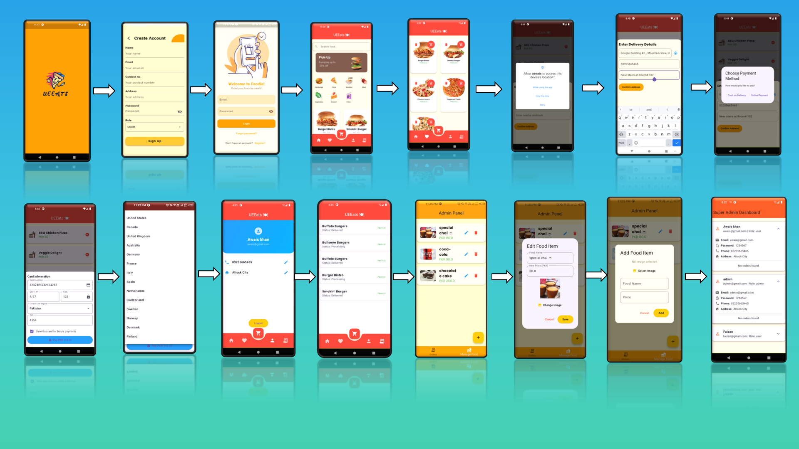

### Working Mechanism of UEeats

.png>)

### Splash Screen


### Signin Screen


### Signup Screen

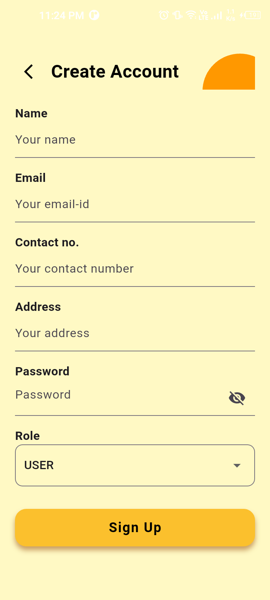

### Home Screen

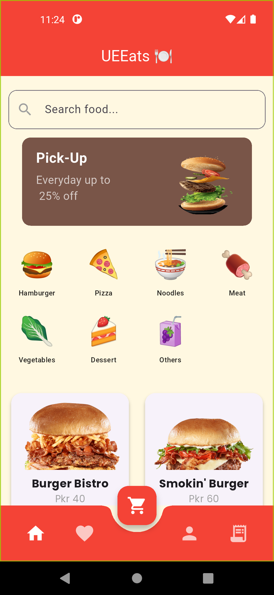

### Food Menu

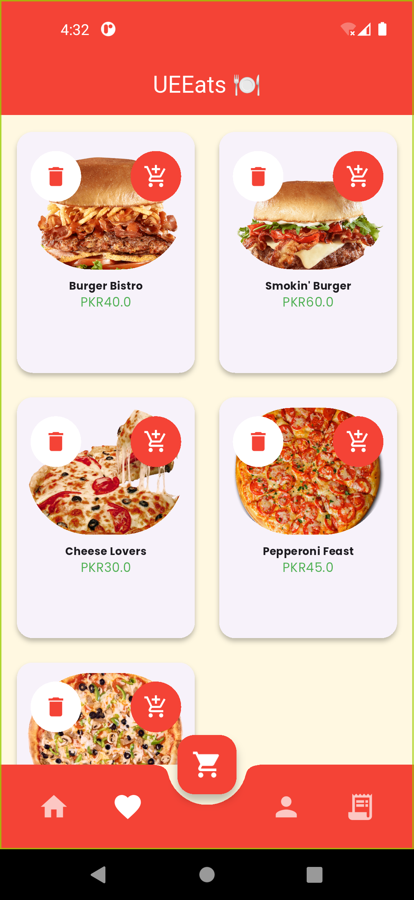

### Food Details

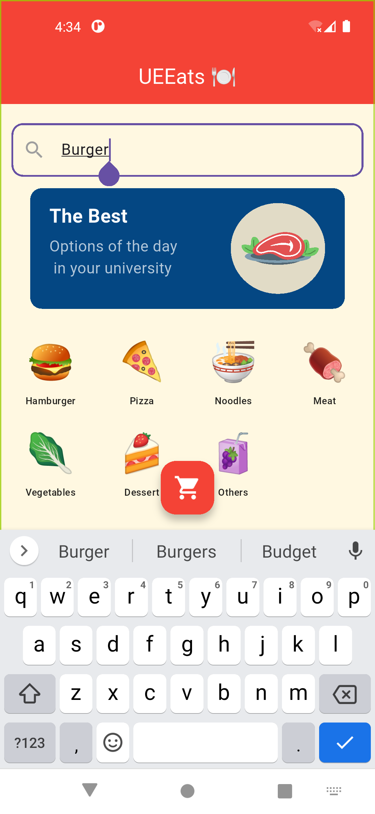

### Cart Screen


### Order Screen

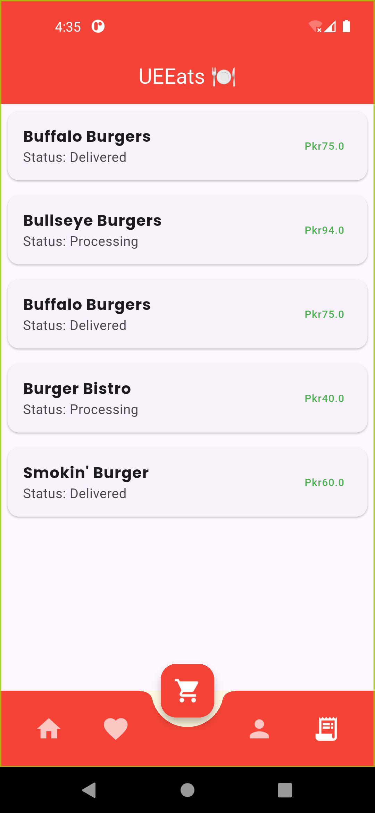

### User delivery Location screen

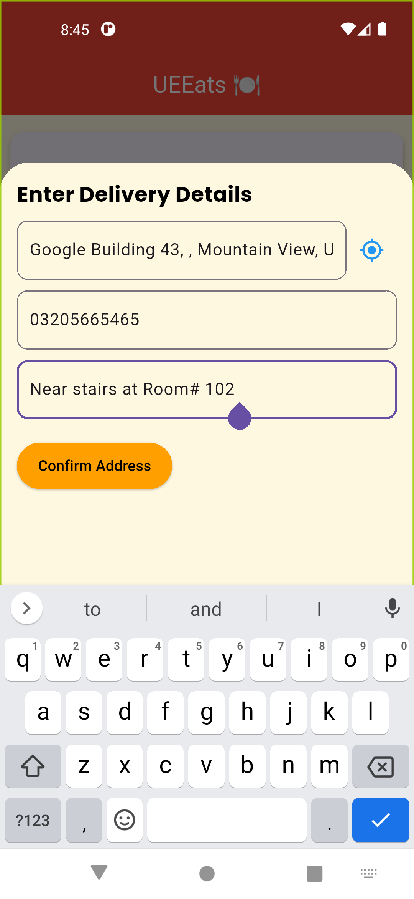

### Location Details

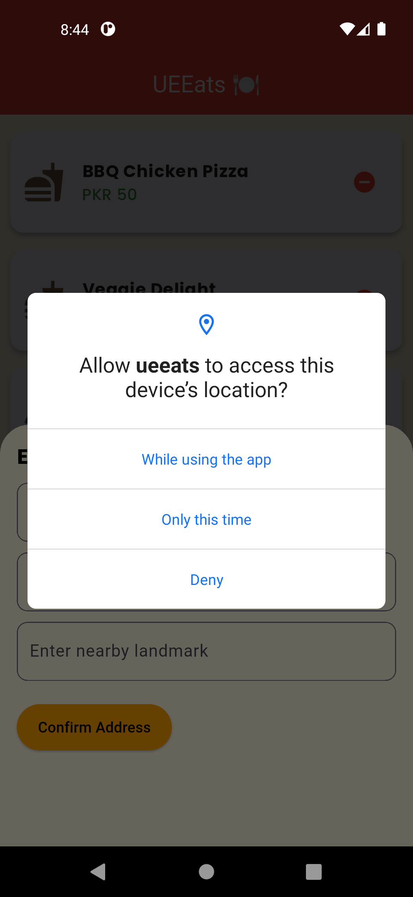

### Payment Details

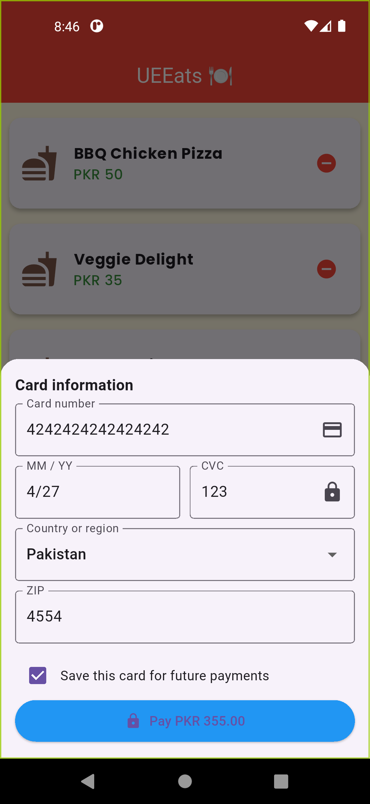

### Admin Panel

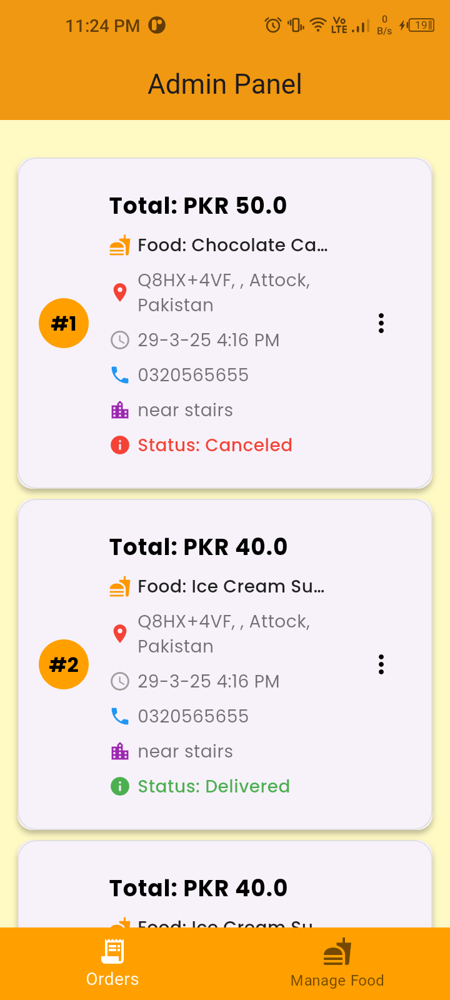

### Super Admin Panel Details

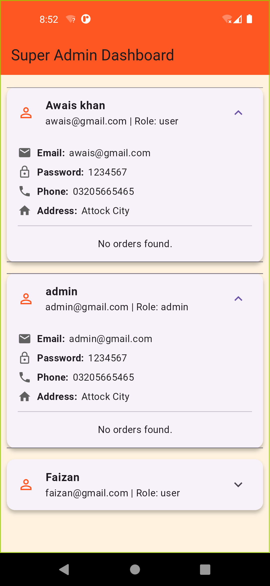

_(Replace the screenshot names with your actual image names if different)_

---

# 📂 Project Structure

```
ueeats-flutter-mobile-app
│
├── lib
│   ├── screens
│   ├── widgets
│   ├── models
│   └── main.dart
│
├── assets
│
├── screenshots
│
├── pubspec.yaml
└── README.md
```

---

# ⚙️ Installation

### 1️⃣ Clone the repository

```bash
git clone https://github.com/YOUR_USERNAME/ueeats-flutter-mobile-app.git
```

### 2️⃣ Navigate to the project folder

```bash
cd ueeats-flutter-mobile-app
```

### 3️⃣ Install dependencies

```bash
flutter pub get
```

### 4️⃣ Run the application

```bash
flutter run
```

---

# 🎯 Project Purpose

This application was developed to provide **a convenient mobile solution for ordering food within university campuses**.

Students can easily browse cafeteria menus, select their meals, and place orders using a simple and intuitive mobile interface.

---

# 🚀 Future Improvements

- Online payment integration
- Real-time order tracking
- Push notifications
- User profile management
- Order history

---

# ueeat

A new Flutter project.

## Getting Started

This project is a starting point for a Flutter application.

A few resources to get you started if this is your first Flutter project:

- [Lab: Write your first Flutter app](https://docs.flutter.dev/get-started/codelab)
- [Cookbook: Useful Flutter samples](https://docs.flutter.dev/cookbook)

For help getting started with Flutter development, view the
[online documentation](https://docs.flutter.dev/), which offers tutorials,
samples, guidance on mobile development, and a full API reference.

# 👨‍💻 Author

**Awais Khan**
Software Engineer | MERN Stack & Flutter Developer

GitHub
https://github.com/Awais007khan

LinkedIn
(Add your LinkedIn profile link)

---

# ⭐ Support

If you like this project, consider **giving it a star ⭐ on GitHub**.
